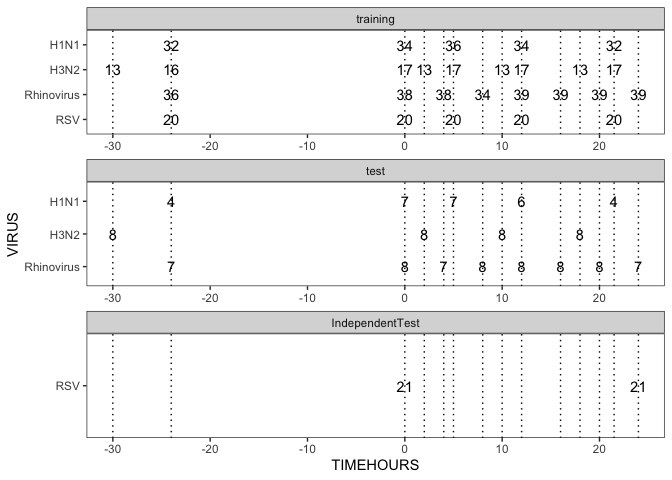
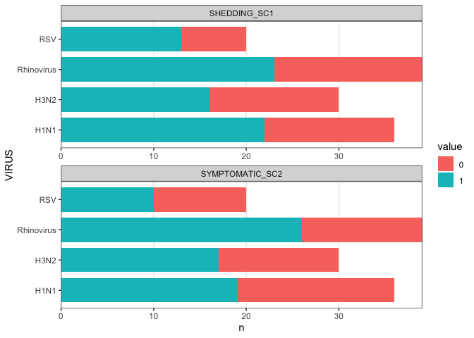
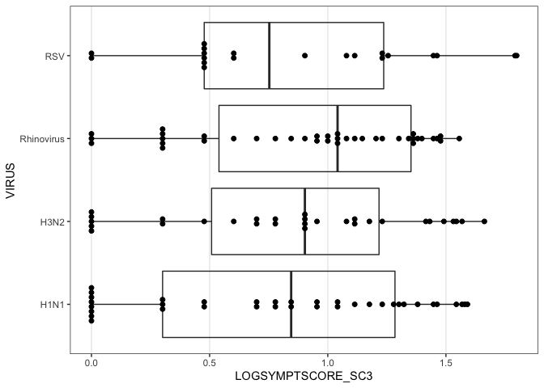

DREAN RV Fig1cd
================
Slim FOURATI
12/09/2014

``` r
suppressPackageStartupMessages(library(package = "knitr"))
suppressPackageStartupMessages(library(package = "Biobase"))
suppressPackageStartupMessages(library(package = "ggplot2"))
suppressPackageStartupMessages(library(package = "dplyr"))
suppressPackageStartupMessages(library(package = "tidyr"))
```

set session options

``` r
knitr::opts_chunk$set(echo = TRUE) # do not echo chunks
opts_chunk$set(tidy = FALSE, fig.path = "../figure/")
options(dplyr.summarise.inform = FALSE)
workDir <- dirname(getwd())
```

``` r
load(file = file.path(workDir, "output/dream.eset.RData"))
```

``` r
pData(eset) %>%
  mutate(SET = gsub(pattern = ".+[c|C]hallenge_([^_]+).+",
                    replacement = "\\1",
                    Filename),
         VIRUS = gsub(pattern     = " Duke| UVA|DEE[^ ]+ ", 
                      replacement = "",
                      STUDYID),
         VIRUS = ifelse(test = !is.na(SHAM),
                        yes  = "SHAM",
                        no   = VIRUS)) %>%
  select(SUBJECTID, VIRUS, SET) %>%
  distinct() %>%
  group_by(SET) %>%
  summarize(n = n())
```

    ## # A tibble: 3 × 2
    ##   SET                 n
    ##   <chr>           <int>
    ## 1 IndependentTest    21
    ## 2 test               23
    ## 3 training          125

``` r
plotDF <- pData(eset) %>%
  mutate(SET = gsub(pattern = ".+[c|C]hallenge_([^_]+).+",
                    replacement = "\\1",
                    Filename),
         VIRUS = gsub(pattern     = " Duke| UVA|DEE[^ ]+ ", 
                      replacement = "",
                      STUDYID),
         VIRUS = ifelse(test = !is.na(SHAM),
                        yes  = "SHAM",
                        no   = VIRUS)) %>% 
  select(SUBJECTID, SET, VIRUS, TIMEHOURS) %>%
  distinct() %>%
  group_by(SET, VIRUS, TIMEHOURS) %>%
  summarize(n = n()) %>%
  ungroup() %>%
  mutate(VIRUS = factor(VIRUS, levels = rev(sort(unique(VIRUS)))),
         SET   = factor(SET, levels = rev(sort(unique(SET)))))

ggplot(data    = plotDF,
       mapping = aes(x = TIMEHOURS, y = VIRUS)) +
  geom_text(mapping = aes(label = n)) +
  scale_x_continuous(limits = c(-30, 24)) +
  geom_vline(xintercept = unique(plotDF$TIMEHOURS), linetype = 3) +
  facet_wrap(facets = ~SET, ncol = 1, scale = "free") +
  theme_bw() +
  theme(panel.grid.major = element_blank(),
        panel.grid.minor = element_blank())
```

    ## Warning: Removed 84 rows containing missing values (geom_text).

    ## Warning: Removed 123 rows containing missing values (geom_vline).

<!-- -->

``` r
plotDF <- pData(eset) %>%
  mutate(SET = gsub(pattern = ".+[c|C]hallenge_([^_]+).+",
                    replacement = "\\1",
                    Filename),
         VIRUS = gsub(pattern     = " Duke| UVA|DEE[^ ]+ ", 
                      replacement = "",
                      STUDYID)) %>%
  filter(is.na(SHAM) & SET %in% "training") %>%
  select(SUBJECTID, SHEDDING_SC1, SYMPTOMATIC_SC2, VIRUS) %>%
  distinct() %>%
  gather(cname, value, -SUBJECTID, -VIRUS) %>%
  group_by(cname, value, VIRUS) %>%
  summarize(n = n()) %>%
  ungroup() %>%
  mutate(value = factor(value))

ggplot(data = plotDF,
       mapping = aes(x = VIRUS, y = n, fill = value)) +
  geom_bar(stat = "identity", width = 0.8) +
  coord_flip() +
  facet_wrap(facets = ~cname, ncol = 1,
             scale = "free") +
  scale_y_continuous(expand = c(0, 0)) +
  theme_bw() +
  theme(panel.grid.minor = element_blank(),
        panel.grid.major.y = element_blank())
```

<!-- -->

``` r
percentDF <- plotDF %>%
  group_by(cname,  VIRUS) %>%
  summarize(total = sum(n)) %>%
  merge(x = plotDF, by = c("cname", "VIRUS")) %>%
  mutate(percent = n/total * 100,
         percent = round(percent))
```

``` r
plotDF <- pData(eset) %>%
  mutate(SET = gsub(pattern = ".+[c|C]hallenge_([^_]+).+",
                    replacement = "\\1",
                    Filename),
         VIRUS = gsub(pattern     = " Duke| UVA|DEE[^ ]+ ", 
                      replacement = "",
                      STUDYID)) %>%
  filter(is.na(SHAM) & SET %in% "training") %>%
  select(SUBJECTID, LOGSYMPTSCORE_SC3, VIRUS) %>%
  distinct()

ggplot(data = plotDF,
       mapping = aes(x = VIRUS, y = LOGSYMPTSCORE_SC3)) +
  geom_boxplot(fill = "transparent", width = 0.8, outlier.colour = "transparent") +
  geom_dotplot(binaxis = "y", binwidth = 0.001, stackdir = "center", dotsize = 20) +
  coord_flip() +
  theme_bw() +
  theme(panel.grid.minor = element_blank(),
        panel.grid.major.y = element_blank())
```

<!-- -->

``` r
sessionInfo()
```

    ## R version 4.1.2 (2021-11-01)
    ## Platform: x86_64-apple-darwin20.6.0 (64-bit)
    ## Running under: macOS Big Sur 11.6
    ## 
    ## Matrix products: default
    ## BLAS:   /usr/local/Cellar/openblas/0.3.18/lib/libopenblasp-r0.3.18.dylib
    ## LAPACK: /usr/local/Cellar/r/4.1.2/lib/R/lib/libRlapack.dylib
    ## 
    ## locale:
    ## [1] en_US.UTF-8/en_US.UTF-8/en_US.UTF-8/C/en_US.UTF-8/en_US.UTF-8
    ## 
    ## attached base packages:
    ## [1] parallel  stats     graphics  grDevices utils     datasets  methods  
    ## [8] base     
    ## 
    ## other attached packages:
    ## [1] tidyr_1.1.4         dplyr_1.0.7         ggplot2_3.3.5      
    ## [4] Biobase_2.52.0      BiocGenerics_0.38.0 knitr_1.37         
    ## 
    ## loaded via a namespace (and not attached):
    ##  [1] highr_0.9        pillar_1.6.4     compiler_4.1.2   tools_4.1.2     
    ##  [5] digest_0.6.29    evaluate_0.14    lifecycle_1.0.1  tibble_3.1.6    
    ##  [9] gtable_0.3.0     pkgconfig_2.0.3  rlang_0.4.12     rstudioapi_0.13 
    ## [13] cli_3.1.0        DBI_1.1.1        yaml_2.2.1       xfun_0.29       
    ## [17] fastmap_1.1.0    withr_2.4.3      stringr_1.4.0    generics_0.1.1  
    ## [21] vctrs_0.3.8      grid_4.1.2       tidyselect_1.1.1 glue_1.6.0      
    ## [25] R6_2.5.1         fansi_1.0.0      rmarkdown_2.11   farver_2.1.0    
    ## [29] purrr_0.3.4      magrittr_2.0.1   scales_1.1.1     ellipsis_0.3.2  
    ## [33] htmltools_0.5.2  assertthat_0.2.1 colorspace_2.0-2 labeling_0.4.2  
    ## [37] utf8_1.2.2       stringi_1.7.6    munsell_0.5.0    crayon_1.4.2
