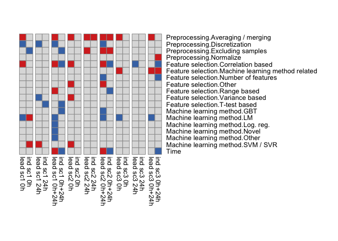
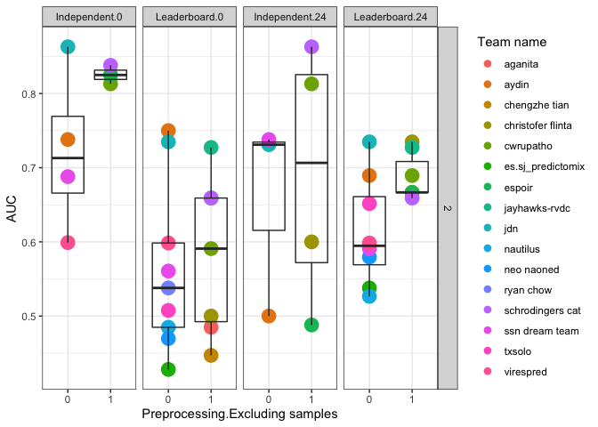

DREAN RV Fig3
================
Slim FOURATI
12/09/2014

``` r
suppressPackageStartupMessages(library(package = "knitr"))
suppressPackageStartupMessages(library(package = "readxl"))
suppressPackageStartupMessages(library(package = "readr"))
suppressPackageStartupMessages(library(package = "glmnet"))
suppressPackageStartupMessages(library(package = "pheatmap"))
suppressPackageStartupMessages(library(package = "ggplot2"))
suppressPackageStartupMessages(library(package = "nlme"))
suppressPackageStartupMessages(library(package = "dplyr"))
suppressPackageStartupMessages(library(package = "tidyr"))
suppressPackageStartupMessages(library(package = "tibble"))
```

set session options

``` r
knitr::opts_chunk$set(echo = TRUE) # do not echo chunks
opts_chunk$set(tidy = FALSE, fig.path = "../figure/")
options(dplyr.summarise.inform = FALSE)
workDir <- dirname(getwd())
```

``` r
inputFile <- "Project 4 analysis summary KYedit - uniform terms.xlsx"
inputDF <- read_excel(path = file.path(workDir, "input", inputFile))
```

    ## New names:
    ## * `Team name` -> `Team name...1`
    ## * `Team name` -> `Team name...15`

``` r
# correct subchallenge and time fields
inputDF <- inputDF %>%
  mutate(Subchallenge = gsub(pattern     = "42737.0",
                             replacement = "1,2",
                             Subchallenge),
         Subchallenge = gsub(pattern     = "42769.0",
                             replacement = "2,3",
                             Subchallenge),
         Subchallenge = gsub(pattern     = ".0",
                             replacement = "",
                             Subchallenge),
         Subchallenge = gsub(pattern     = "ALL",
                             replacement = "1,2,3",
                             Subchallenge),
         Time         = gsub(pattern     = ".0",
                             replacement = "",
                             Time),
         Time         = gsub(pattern     = "ALL",
                             replacement = "0,24",
                             Time))
# split Subchallenge
subchallengeLS <- inputDF$Subchallenge %>%
  strsplit(split = ",") %>%
  setNames(nm = rownames(inputDF)) %>%
  stack() %>%
  mutate(ind = as.vector(ind))
inputDF <- inputDF[match(subchallengeLS$ind, table = rownames(inputDF)), ] %>%
  mutate(Subchallenge = subchallengeLS$values)
# split Time
timeLS <- inputDF$Time %>%
  strsplit(split = ",") %>%
  setNames(nm = rownames(inputDF)) %>%
  stack() %>%
  mutate(ind = as.vector(ind))
inputDF <- inputDF[match(timeLS$ind, table = rownames(inputDF)), ] %>%
  mutate(Time = timeLS$values)
# add rownames to input
inputDF <- inputDF %>%
  rownames_to_column()
# split Preprocessing
preprocLS <- inputDF$Preprocessing %>%
  strsplit(split = ", ") %>%
  setNames(nm = inputDF$rowname) %>%
  stack() %>%
  mutate(ind  = as.vector(ind),
         flag = 1) %>%
  filter(!(values %in% "NA") & !is.na(values)) %>%
  spread(values, flag) %>%
  setNames(nm = paste0("Preprocessing.", names(.)))
preprocLS[is.na(preprocLS)] <- 0
inputDF <- inputDF %>%
  merge(y = preprocLS, by.x = "rowname", by.y = "Preprocessing.ind", all.x = TRUE)
# split Feature selection
featLS <- inputDF$"Feature selection" %>%
  gsub(pattern     = "t-test",
       replacement = "T-test based") %>%
  gsub(pattern     = "Poisson Elastic Net",
       replacement = "Machine learning method related") %>%
  strsplit(split = ", ") %>%
  setNames(nm = inputDF$rowname) %>%
  stack() %>%
  mutate(ind = as.vector(ind),
         flag = 1) %>%
  filter(!(values %in% "NA")) %>%
  distinct() %>% # Team Jiayi Hou Feature selection is duplicated
  spread(values, flag) %>%
  setNames(nm = paste0("Feature selection.", names(.)))
featLS[is.na(featLS)] <- 0
inputDF <- inputDF %>%
  merge(y = featLS, by.x = "rowname", by.y = "Feature selection.ind", all.x = TRUE)
# split Machine learning
mlLS <- inputDF$"Machine learning method" %>%
  gsub(pattern = "For both SC1 and SC2.+",
       replacement = "Other") %>%
  strsplit(split = ", ") %>%
  setNames(nm = inputDF$rowname) %>%
  stack() %>%
  mutate(ind = as.character(ind),
         flag = 1) %>%
  filter(!(values %in% "NA")) %>%
  spread(values, flag) %>%
  setNames(nm = paste0("Machine learning method.", names(.)))
mlLS[is.na(mlLS)] <- 0
inputDF <- inputDF %>%
  merge(y = mlLS, by.x = "rowname", by.y = "Machine learning method.ind", all.x = TRUE)
```

``` r
indResDF <- read_csv(file = file.path(workDir, "input/Independent_SC1_SC2_SC3.csv"))
```

    ## Rows: 18 Columns: 7

    ## ── Column specification ────────────────────────────────────────────────────────
    ## Delimiter: ","
    ## chr (1): team
    ## dbl (6): Independent_SC1_0_AUC, Independent_SC1_24_AUC, Independent_SC2_0_AU...

    ## 
    ## ℹ Use `spec()` to retrieve the full column specification for this data.
    ## ℹ Specify the column types or set `show_col_types = FALSE` to quiet this message.

``` r
# correct team name
inputDF <- inputDF %>%
  mutate(`Team name...1` = tolower(`Team name...1`),
         `Team name...1` = gsub(pattern = "jiayi hou",
                               replacement = "isabella jiayi hou",
                               `Team name...1`))
inputDF <- merge(x     = inputDF,
                 y     = indResDF,
                 by.x  = "Team name...1",
                 by.y  = "team",
                 all.x = TRUE)
```

``` r
leadResDF <- read_csv(file = file.path(workDir, "input/Leaderboard_SC1_SC2_SC3.csv")) %>%
  mutate(team = ifelse(test = team %in% "cgateam",
                       yes  = "cga team",
                       no   = team),
         team = ifelse(test = team %in% "jiayi hou",
                       yes  = "isabella jiayi hou",
                       no   = team))
```

    ## Rows: 31 Columns: 7

    ## ── Column specification ────────────────────────────────────────────────────────
    ## Delimiter: ","
    ## chr (1): team
    ## dbl (6): Leaderboard_SC1_hour0_AUC, Leaderboard_SC1_hour24_AUC, Leaderboard_...

    ## 
    ## ℹ Use `spec()` to retrieve the full column specification for this data.
    ## ℹ Specify the column types or set `show_col_types = FALSE` to quiet this message.

``` r
# correct team name
inputDF <- merge(x     = inputDF,
                 y     = leadResDF,
                 by.x  = "Team name...1",
                 by.y  = "team",
                 all.x = TRUE)
```

``` r
summaryDF <- read_excel(path = file.path(workDir, "input/Project4.summary.xlsx"))
```

    ## New names:
    ## * `` -> ...1

``` r
mat <- summaryDF %>%
  gather(cname, value, -...1) %>%
  mutate(value = c("+" = 1, "-" = -1)[value]) %>%
  spread(cname, value) %>%
  as.data.frame()
rownames(mat) <- mat$"...1"
mat$X__1 <- NULL
mat <- mat[summaryDF$"...1", names(summaryDF)[-1]]
pheatmap(mat,
         cluster_cols = FALSE,
         cluster_rows = FALSE,
         legend = FALSE,
         cellwidth = 10,
         cellheight = 10,
         gaps_col = seq(from = 2, to = ncol(mat), by = 2))
```

<!-- -->

``` r
plotDF <- NULL
#
#
tempDF <- filter(inputDF, Subchallenge %in% 2 & Time %in% 0) %>%
  rename(`Team name` = `Team name...1`) %>%
  select(`Team name`,
         Subchallenge,
         Time,
         Leaderboard_SC2_hour0_AUC,
         `Independent_SC2_0_AUC`,
         `Preprocessing.Excluding samples`) %>%
  gather(Dataset,
         AUC,
         -`Team name`,
         -Subchallenge,
         -Time,
         -`Preprocessing.Excluding samples`)
plotDF <- rbind(plotDF, tempDF)
tempDF <- filter(inputDF, Subchallenge %in% 2 & Time %in% 24) %>%
    rename(`Team name` = `Team name...1`) %>%

  select(`Team name`,
         Subchallenge,
         Time,
         Leaderboard_SC2_hour24_AUC,
         `Independent_SC2_24_AUC`,
         `Preprocessing.Excluding samples`) %>%
  gather(Dataset,
         AUC,
         -`Team name`,
         -Subchallenge,
         -Time,
         -`Preprocessing.Excluding samples`)
plotDF <- rbind(plotDF, tempDF)
#
# plot
plotDF <- plotDF %>%
  filter(!is.na(`Preprocessing.Excluding samples`)) %>%
  mutate(`Preprocessing.Excluding samples` = 
           factor(`Preprocessing.Excluding samples`),
         Dataset = gsub(pattern = "^([^_]+).+",
                        replacement = "\\1",
                        Dataset),
         AUC = as.numeric(AUC))
ggplot(data = plotDF,
       mapping = aes(x = `Preprocessing.Excluding samples`, y = AUC)) +
  geom_dotplot(binaxis = "y", binwidth = 0.01, dotsize = 2, 
               stackdir = "center", mapping = aes(fill = `Team name`),
               color = "transparent") +
  geom_boxplot(outlier.colour = "transparent", fill = "transparent") +
  facet_grid(facets = Subchallenge ~ interaction(Dataset, Time)) +
  labs(y = "AUC") +
  theme_bw()
```

    ## Warning: Removed 17 rows containing non-finite values (stat_bindot).

    ## Warning: Removed 17 rows containing non-finite values (stat_boxplot).

<!-- -->

``` r
statDF <- plotDF %>%
  group_by(Dataset, Subchallenge, Time) %>%
  do(p = wilcox.test(formula = AUC ~ `Preprocessing.Excluding samples`,
                     data = .)$p.value) %>%
  mutate(p = unlist(p))
```

    ## Warning in wilcox.test.default(x = c(0.75, 0.428030303030303,
    ## 0.734848484848485, : cannot compute exact p-value with ties

    ## Warning in wilcox.test.default(x = c(0.689393939393939, 0.537878787878788, :
    ## cannot compute exact p-value with ties

``` r
sessionInfo()
```

    ## R version 4.1.2 (2021-11-01)
    ## Platform: x86_64-apple-darwin20.6.0 (64-bit)
    ## Running under: macOS Big Sur 11.6
    ## 
    ## Matrix products: default
    ## BLAS:   /usr/local/Cellar/openblas/0.3.18/lib/libopenblasp-r0.3.18.dylib
    ## LAPACK: /usr/local/Cellar/r/4.1.2/lib/R/lib/libRlapack.dylib
    ## 
    ## locale:
    ## [1] en_US.UTF-8/en_US.UTF-8/en_US.UTF-8/C/en_US.UTF-8/en_US.UTF-8
    ## 
    ## attached base packages:
    ## [1] stats     graphics  grDevices utils     datasets  methods   base     
    ## 
    ## other attached packages:
    ##  [1] tibble_3.1.6    tidyr_1.1.4     dplyr_1.0.7     nlme_3.1-153   
    ##  [5] ggplot2_3.3.5   pheatmap_1.0.12 glmnet_4.1-3    Matrix_1.4-0   
    ##  [9] readr_2.1.1     readxl_1.3.1    knitr_1.37     
    ## 
    ## loaded via a namespace (and not attached):
    ##  [1] shape_1.4.6        tidyselect_1.1.1   xfun_0.29          purrr_0.3.4       
    ##  [5] splines_4.1.2      lattice_0.20-45    colorspace_2.0-2   vctrs_0.3.8       
    ##  [9] generics_0.1.1     htmltools_0.5.2    yaml_2.2.1         utf8_1.2.2        
    ## [13] survival_3.2-13    rlang_0.4.12       pillar_1.6.4       glue_1.6.0        
    ## [17] withr_2.4.3        DBI_1.1.1          bit64_4.0.5        RColorBrewer_1.1-2
    ## [21] foreach_1.5.1      lifecycle_1.0.1    stringr_1.4.0      munsell_0.5.0     
    ## [25] gtable_0.3.0       cellranger_1.1.0   codetools_0.2-18   evaluate_0.14     
    ## [29] labeling_0.4.2     tzdb_0.2.0         fastmap_1.1.0      parallel_4.1.2    
    ## [33] fansi_1.0.0        highr_0.9          Rcpp_1.0.7         scales_1.1.1      
    ## [37] vroom_1.5.7        farver_2.1.0       bit_4.0.4          hms_1.1.1         
    ## [41] digest_0.6.29      stringi_1.7.6      grid_4.1.2         cli_3.1.0         
    ## [45] tools_4.1.2        magrittr_2.0.1     crayon_1.4.2       pkgconfig_2.0.3   
    ## [49] ellipsis_0.3.2     rstudioapi_0.13    assertthat_0.2.1   rmarkdown_2.11    
    ## [53] iterators_1.0.13   R6_2.5.1           compiler_4.1.2
