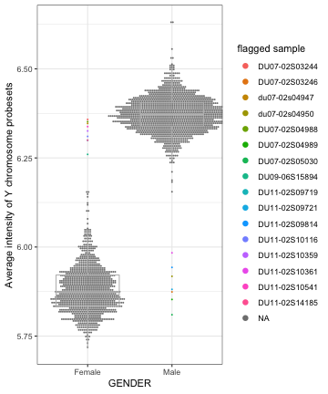

Load packages

```r
suppressPackageStartupMessages(library(package = "knitr"))
suppressPackageStartupMessages(library(package = "plyr"))
suppressPackageStartupMessages(library(package = "synapser"))
suppressPackageStartupMessages(library(package = "synapserutils"))
suppressPackageStartupMessages(library(package = "affy"))
suppressPackageStartupMessages(library(package = "hgu133a2cdf"))
suppressPackageStartupMessages(library(package = "amap"))
suppressPackageStartupMessages(library(package = "tidyverse"))
```

Set default options/variables

```r
workDir <- dirname(getwd())
opts_chunk$set(tidy = FALSE, fig.path = "../figure/")
options(readr.num_columns = 0,
        stringsAsFactors  = FALSE,
	width             = 80)
```

Download CEL files from synapse

```r
# create .synapseConfig file in home directory with username and api key
capture.output(synLogin(silent = TRUE),
	       file = "/dev/null")

# fetch CEL files from the challenge repisotory
walkPath <- synapserutils::walk("syn5647810")
walkLS <-  as.list(walkPath)

tarIds <- grep(pattern = "CEL.tar.gz", unlist(walkLS))
tarSyn <- unlist(walkLS)[tarIds + 1]
tarDF <- data.frame(Filename     = unlist(walkLS)[tarIds],
		    `Synapse ID` = tarSyn,
		    check.names  = FALSE)
# download CEL files in local directory
for (i in 1:nrow(tarDF)) {
  syn <- tarDF$"Synapse ID"[i]
  capture.output(entity <- synGet(syn,
				  downloadLocation = getwd(),
				  ifcollision      = "overwrite.local"),
		 file = "/dev/null")
}
# decompress TARbales
targetDir <- "raw"
dir.create(path = targetDir)
for (i in 1:nrow(tarDF)) {
  untar(tarfile    = tarDF$Filename[i],
	exdir      = targetDir,
	compressed = TRUE)
}
```

Download samples annotation

```r
clinIds <- grep(pattern = "CLINICAL.tsv", unlist(walkLS))
clinSyn <- unlist(walkLS)[clinIds + 1]
clinDF <- data.frame(Filename     = unlist(walkLS)[clinIds],
		    `Synapse ID` = clinSyn,
		    check.names  = FALSE)
# download sample annotation files in local directory
for (i in 1:nrow(clinDF)) {
  syn <- clinDF$"Synapse ID"[i]
  capture.output(entity <- synGet(syn,
				  downloadLocation = getwd(),
				  ifcollision      = "overwrite.local"),
		 file = "/dev/null")
}
```

Download features annotation

```r
featFilename <- "HG-U133A_2.na35.annot.csv.zip"
featIds <- which(unlist(walkLS) %in% featFilename)
featSyn <- unlist(walkLS)[featIds + 1]
# download sample annotation files in local directory
capture.output(entity <- synGet(featSyn,
				downloadLocation = getwd(),
				ifcollision      = "overwrite.local"),
	       file = "/dev/null")
```

Read CEL files

```r
esetRaw <- ReadAffy(filenames = list.files(path       = targetDir,
                                           pattern    = ".CEL|.cel",
                                           recursive  = TRUE,
                                           full.names = TRUE))
print(esetRaw)
```

```
## AffyBatch object
## size of arrays=732x732 features (1057 kb)
## cdf=HG-U133A_2 (22277 affyids)
## number of samples=2579
## number of genes=22277
## annotation=hgu133a2
## notes=
```

Read samples annotation

```r
sampleAnnot <- NULL
for (sampleAnnotFile in clinDF$Filename) {
  sampleAnnotTemp <- read_tsv(file = sampleAnnotFile) %>%
    as.data.frame() %>%
    mutate(Filename = sampleAnnotFile)
  sampleAnnot <- rbind.fill(sampleAnnot, sampleAnnotTemp)
}
sampleAnnot <- sampleAnnot[match(sampleNames(esetRaw),
				 table = sampleAnnot$CEL), ]
rownames(sampleAnnot) <- sampleAnnot$CEL
```

Read features annotation

```r
featAnnotZ <- "HG-U133A_2.na35.annot.csv.zip"
featAnnotName <- unzip(zipfile = featAnnotZ, exdir = targetDir) %>%
  grep(pattern = "csv$", value = TRUE)
featAnnot <- read_csv(file = featAnnotName, comment = "#") %>%
  as.data.frame()
rownames(featAnnot) <- featAnnot$"Probe Set ID"
```

Delete tempory files

```r
# delete CEL tarbales
unlink(tarDF$Filename)
# delete raw folder with CEL files
unlink(targetDir, recursive = TRUE)
# delete sample annotations files
unlink(clinDF$Filename)
# delete feature annotation file
unlink(featFilename)
```

Normalizing raw expression

```r
eset <- rma(esetRaw, verbose = FALSE)
# adding phenotipic and features annotation to ExpressionSet
pData(eset) <- sampleAnnot[sampleNames(eset), ]
fData(eset) <- featAnnot[featureNames(eset), ]
# save ExpressionSet objects
save(eset, file = file.path(workDir, "output/dream.eset.RData"))
```

Gender check

```r
esetY <- eset[grep(pattern = "Y",
                   fData(eset)$"Chromosomal Location"), ]
# plot average Y genes expression as a function of gender
plotDF <- exprs(esetY) %>%
  colMeans() %>%
  data.frame(muY = .) %>%
  rownames_to_column() %>%
  merge(pData(eset), by.x = "rowname", by.y = "CEL")
# flag suspecious samples
iqrDF <- plotDF %>%
  group_by(GENDER) %>%
  summarize(iqr = IQR(muY),
            q1  = quantile(muY, probs = 0.25),
            q3  = quantile(muY, probs = 0.75)) %>%
  mutate(GENDER = rev(GENDER))
flagDF <- plotDF %>%
  merge(iqrDF, by = "GENDER") %>%
  filter((GENDER %in% "Female" & muY > q1 - 1.5 * iqr) |
         (GENDER %in% "Male" & muY < q3 + 1.5 * iqr))
plotDF <- plotDF %>%
  mutate(flag = ifelse(test = SAMPLEID %in% flagDF$SAMPLEID,
             yes = SAMPLEID,
             no  = NA),
         flag = factor(flag))

ggplot(data = plotDF,
                  mapping = aes(x = GENDER, y = muY)) +
  geom_dotplot(binaxis  = "y",
               binwidth = 0.005,
               stackdir = "center",
               mapping  = aes(fill = flag),
               color    = "transparent") +
  geom_boxplot(outlier.colour = "transparent", color = "grey",
               fill  = "transparent") +
  scale_fill_discrete(name = "flagged sample") +
  labs(y = "Average intensity of Y chromosome probesets") +
  theme_bw() +
  theme(legend.key = element_blank())
```



```r
flagDF %>%
  select(rowname, SUBJECTID, GENDER, muY, STUDYID, Filename) %>%
  print()
```

```
##                                      rowname SUBJECTID GENDER      muY
## 1         1359_39433_H133A2_14189_S03244.CEL        19 Female 6.358004
## 2         1359_39473_H133A2_14200_S04947.CEL        19 Female 6.346838
## 3         1359_39628_H133A2_14245_S04988.CEL        19 Female 6.351636
## 4   2959_207664_HG-U133A_2_DU11-02S10116.CEL      5021 Female 6.310402
## 5   2959_207638_HG-U133A_2_DU11-02S10359.CEL      5021 Female 6.325684
## 6   2959_207421_HG-U133A_2_DU11-02S10541.CEL      5021 Female 6.337957
## 7  2011_93218_H133A2_23122_DU09-06S15894.CEL      3019 Female 6.260018
## 8   2959_207767_HG-U133A_2_DU11-02S14185.CEL      5011 Female 6.299781
## 9   2959_207718_HG-U133A_2_DU11-02S09719.CEL      5021 Female 6.299654
## 10       1359_51133_H133A2_DU07-02S05030.CEL        20   Male 5.809904
## 11      1359_39435_H133A2_13984_S03246_2.CEL        20   Male 5.873986
## 12        1359_39634_H133A2_14042_S04989.CEL        20   Male 5.852779
## 13        1359_39476_H133A2_13994_S04950.CEL        20   Male 5.917754
## 14  2959_207510_HG-U133A_2_DU11-02S09814.CEL      5020   Male 5.942774
## 15  2959_207524_HG-U133A_2_DU11-02S10361.CEL      5020   Male 5.983630
## 16  2959_207586_HG-U133A_2_DU11-02S09721.CEL      5020   Male 5.881139
##           STUDYID                                Filename
## 1  Rhinovirus UVA    ViralChallenge_training_CLINICAL.tsv
## 2  Rhinovirus UVA    ViralChallenge_training_CLINICAL.tsv
## 3  Rhinovirus UVA    ViralChallenge_training_CLINICAL.tsv
## 4       DEE5 H3N2    ViralChallenge_training_CLINICAL.tsv
## 5       DEE5 H3N2    ViralChallenge_training_CLINICAL.tsv
## 6       DEE5 H3N2    ViralChallenge_training_CLINICAL.tsv
## 7       DEE3 H1N1    ViralChallenge_training_CLINICAL.tsv
## 8       DEE5 H3N2    ViralChallenge_training_CLINICAL.tsv
## 9       DEE5 H3N2    ViralChallenge_training_CLINICAL.tsv
## 10 Rhinovirus UVA    ViralChallenge_training_CLINICAL.tsv
## 11 Rhinovirus UVA    ViralChallenge_training_CLINICAL.tsv
## 12 Rhinovirus UVA    ViralChallenge_training_CLINICAL.tsv
## 13 Rhinovirus UVA    ViralChallenge_training_CLINICAL.tsv
## 14      DEE5 H3N2 ViralChallenge_test_Phase4_CLINICAL.tsv
## 15      DEE5 H3N2 ViralChallenge_test_Phase4_CLINICAL.tsv
## 16      DEE5 H3N2 ViralChallenge_test_Phase2_CLINICAL.tsv
```

```r
eset$wrongGender <- ifelse(test = sampleNames(eset) %in%
                           flagDF$rowname,
                           yes  = "TRUE",
                           no   = "")
save(eset, file = file.path(workDir, "output/DREAM.eset.RData"))
```
16 samples from the training set have potentially been mislabelled. Those
samples are flaged and might need to be removed from downstream analysis.


Print session info

```r
sessionInfo()
```

```
## R version 3.5.3 (2019-03-11)
## Platform: x86_64-apple-darwin18.2.0 (64-bit)
## Running under: macOS Mojave 10.14.4
## 
## Matrix products: default
## BLAS/LAPACK: /usr/local/Cellar/openblas/0.3.5/lib/libopenblasp-r0.3.5.dylib
## 
## locale:
## [1] en_US.UTF-8/en_US.UTF-8/en_US.UTF-8/C/en_US.UTF-8/en_US.UTF-8
## 
## attached base packages:
## [1] parallel  stats     graphics  grDevices utils     datasets  methods  
## [8] base     
## 
## other attached packages:
##  [1] forcats_0.4.0       stringr_1.4.0       dplyr_0.8.0.1      
##  [4] purrr_0.3.2         readr_1.3.1         tidyr_0.8.3        
##  [7] tibble_2.1.1        ggplot2_3.1.1       tidyverse_1.2.1    
## [10] amap_0.8-16         hgu133a2cdf_2.18.0  affy_1.60.0        
## [13] Biobase_2.42.0      BiocGenerics_0.28.0 synapserutils_0.1.5
## [16] synapser_0.6.54     plyr_1.8.4          knitr_1.22         
## 
## loaded via a namespace (and not attached):
##  [1] Rcpp_1.0.1            lubridate_1.7.4       lattice_0.20-38      
##  [4] assertthat_0.2.1      digest_0.6.18         cellranger_1.1.0     
##  [7] R6_2.4.0              backports_1.1.4       stats4_3.5.3         
## [10] RSQLite_2.1.1         evaluate_0.13         highr_0.8            
## [13] httr_1.4.0            pillar_1.3.1          zlibbioc_1.28.0      
## [16] rlang_0.3.4           lazyeval_0.2.2        readxl_1.3.1         
## [19] rstudioapi_0.10       blob_1.1.1            S4Vectors_0.20.1     
## [22] preprocessCore_1.44.0 labeling_0.3          bit_1.1-14           
## [25] munsell_0.5.0         broom_0.5.2           compiler_3.5.3       
## [28] modelr_0.1.4          xfun_0.6              pkgconfig_2.0.2      
## [31] pack_0.1-1            tidyselect_0.2.5      IRanges_2.16.0       
## [34] codetools_0.2-16      withr_2.1.2           crayon_1.3.4         
## [37] grid_3.5.3            nlme_3.1-139          jsonlite_1.6         
## [40] gtable_0.3.0          DBI_1.0.0             magrittr_1.5         
## [43] scales_1.0.0          cli_1.1.0             stringi_1.4.3        
## [46] PythonEmbedInR_0.3.29 affyio_1.52.0         xml2_1.2.0           
## [49] generics_0.0.2        tools_3.5.3           bit64_0.9-7          
## [52] glue_1.3.1            hms_0.4.2             AnnotationDbi_1.44.0 
## [55] colorspace_1.4-1      BiocManager_1.30.4    rvest_0.3.3          
## [58] memoise_1.1.0         haven_2.1.0
```
